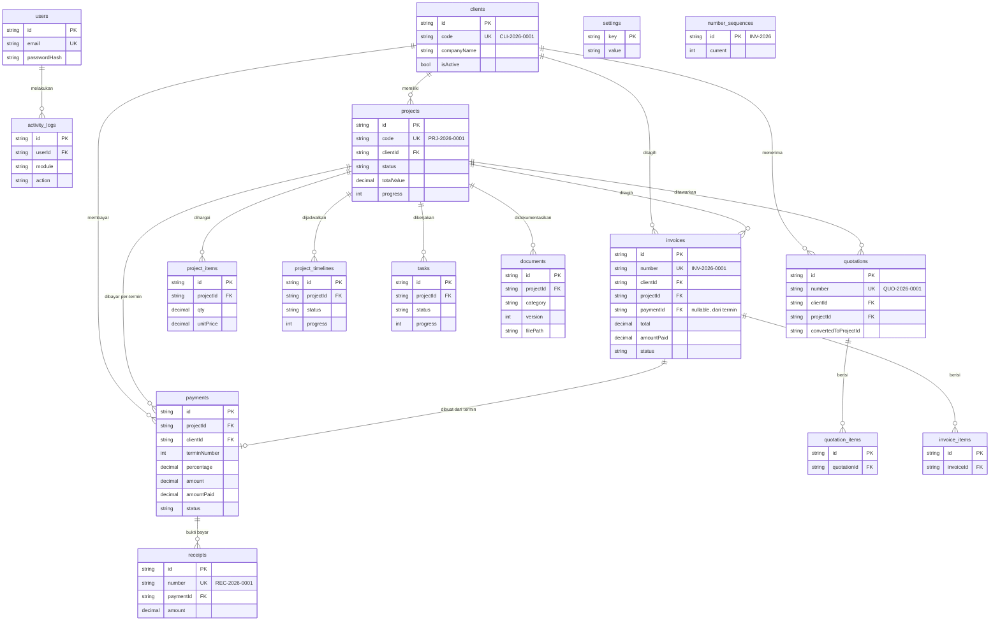

# PPMS — Arsitektur & Desain Database

## 1. Arsitektur Aplikasi

```
┌─────────────────────────────────────────────────┐
│                Browser (Responsive)              │
│   React 18 + Tailwind + Radix UI + Recharts      │
└──────────────────────┬──────────────────────────┘
                       │ HTTPS (JSON + httpOnly cookie session)
┌──────────────────────▼──────────────────────────┐
│              Next.js Server (Node)               │
│  ┌───────────────┐  ┌─────────────────────────┐ │
│  │ Middleware     │  │ App Router Pages (SSR)  │ │
│  │ (auth guard)  │  │ /dashboard /projects …  │ │
│  └───────────────┘  └─────────────────────────┘ │
│  ┌───────────────────────────────────────────┐  │
│  │ REST API Route Handlers  /api/*           │  │
│  │  requireAuth → validasi → Prisma → JSON   │  │
│  └───────────────────────────────────────────┘  │
│  ┌───────────────────────────────────────────┐  │
│  │ Lib: numbering (tx) · finance · settings  │  │
│  │      activity log · format · storage      │  │
│  └───────────────────────────────────────────┘  │
└──────────────┬───────────────────┬──────────────┘
               │                   │
     ┌─────────▼────────┐  ┌───────▼─────────────┐
     │ SQLite (dev)     │  │ Local storage       │
     │ MySQL 8 (prod)   │  │ storage/project-    │
     │ via Prisma ORM   │  │ documents/{projId}/ │
     └──────────────────┘  └─────────────────────┘
```

**Alur tunggal:** UI → fetch API (cookie session) → route handler (`requireAuth`) → Prisma → MySQL/SQLite → respons JSON. File dokumen tidak pernah lewat folder publik; selalu via `/api/documents/[id]` yang memeriksa sesi.

## 2. ERD (Entity Relationship Diagram)



### Ringkasan Relasi

| Relasi | Kardinalitas | Catatan |
|---|---|---|
| Client → Project | 1:N | Project wajib punya client |
| Project → ProjectItem/Timeline/Task/Payment/Document | 1:N | Hapus project (hard) menghapus anak via `onDelete: Cascade` |
| Quotation → Project | N:1 opsional | `convertedToProjectId` menandai hasil konversi |
| Payment (termin) → Invoice | 1:N opsional | Invoice lama di-soft-delete melepas relasi; hanya satu invoice aktif per termin (divalidasi di API) |
| Payment → Receipt | 1:N | Setiap penerimaan pembayaran menghasilkan receipt |
| Invoice.amountPaid | — | Di-update transaksional saat pembayaran dicatat |

## 3. Business Flow (Workflow Freelancer)

```
Client baru
   │  Clients → Tambah Client           (kode CLI- otomatis)
   ▼
Buat Quotation (opsional)
   │  Quotations → Baru → Print/PDF
   ▼  disetujui?
Convert to Project
   │  → project APPROVED, item harga tersalin otomatis
   ▼
Project dibuat / Tambah Termin (%)
   │  Projects → [pilih] → tab Payments → Tambah Termin
   ▼
Buat Invoice DP
   │  tab Payments → "Buat Invoice" pada termin
   │  → nomor INV- otomatis, due date dari settings
   ▼
Pembayaran diterima
   │  tab Payments → "Catat Pembayaran" atau Invoices → Mark as Paid
   │  → amountPaid ter-update, receipt REC- otomatis
   ▼
Project IN_PROGRESS (timeline & task diperbarui, progress auto-rata)
   ▼
Upload Progress Report
   │  tab Documents → Upload (versi otomatis bila nama sama)
   ▼
Invoice Termin 2 … (ulangi)
   ▼
Final Delivery → upload dokumen FINAL → invoice terakhir → PAID
   ▼
Project COMPLETED (actual completion date terisi otomatis)
```

## 4. Keputusan Teknis

| Keputusan | Alasan |
|---|---|
| **Next.js full-stack** (bukan Laravel+Vue) | Satu bahasa (TypeScript), satu deploy, API & UI berbagi tipe; request user |
| **Prisma ORM** | Type-safe, migrasi mudah SQLite↔MySQL, anti SQL-injection bawaan |
| **SQLite di dev, MySQL di prod** | Tanpa install DB server untuk mencoba; produksi tetap MySQL sesuai target |
| **Money = Decimal(14,2)** | Tidak pernah simpan rupiah sebagai string; format `Rp` hanya di UI/PDF |
| **Penomoran via `number_sequences` + upsert increment dalam transaction** | Atomic di SQLite/MySQL; dua request bersamaan tidak mungkin mendapat nomor sama |
| **Soft delete** (clients, projects, invoices, quotations, documents) | Data keuangan tidak boleh hilang; riwayat tetap queryable |
| **Dokumen di luar `public/`** | Akses wajib lewat endpoint ber-autentikasi, bebas path traversal |
| **Print CSS A4** untuk invoice/quotation/receipt | Tanpa dependensi PDF server; `window.print()` → simpan sebagai PDF, layout A4 presisi |
| **JWT session httpOnly** | Tahan CSRF (cookie SameSite), remember me 30 hari |
| **Activity log fire-and-forget** | Kegagalan logging tidak memblokir operasi bisnis |

## 5. Status & Transisi

**Project:** `DRAFT → PROPOSAL → NEGOTIATION → APPROVED → IN_PROGRESS → COMPLETED` (bisa `ON_HOLD` / `CANCELLED` kapan saja). Menandai COMPLETED otomatis mengisi `actualCompletionDate` & progress 100%.

**Payment:** `PENDING → DUE (≤3 hari) → OVERDUE (lewat) → PARTIALLY_PAID → PAID`, atau `CANCELLED`. Status diturunkan otomatis dari `amountPaid` + `dueDate`.

**Invoice:** `DRAFT → SENT → PARTIALLY_PAID → PAID`, atau `OVERDUE` (otomatis), `CANCELLED`.

**Quotation:** `DRAFT → SENT → APPROVED | REJECTED | EXPIRED`. APPROVED + convert → project baru.
